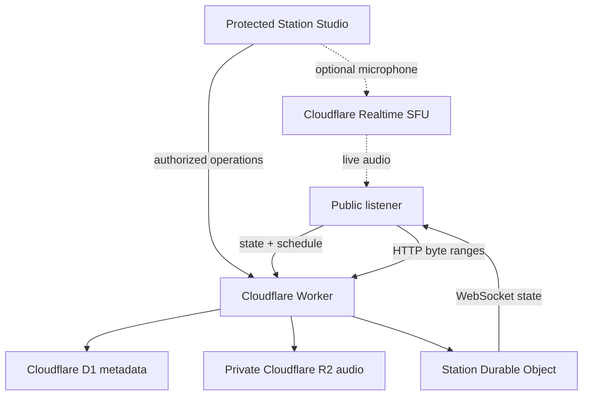

# SIDEBAND — Audio Broadcast Workbench

**Version:** SIDEBAND v0.2.0  
**License:** Massachusetts Institute of Technology (MIT) License

SIDEBAND is a self-hosted, audio-only internet station and browser broadcast console. One operator can import authorized audio, manage a library, assemble playlists and program clocks, publish a schedule, monitor the authoritative on-air state, fire carts, recover to fallback audio, and optionally put a microphone live.

SIDEBAND is not an amplitude-modulation or frequency-modulation transmitter. It emits no radio-frequency energy. It is also not an Icecast or SHOUTcast mount-point server. Its public player synchronizes browsers to timestamped station state and delivers prerecorded files through ordinary Hypertext Transfer Protocol (HTTP) byte ranges.

## What is complete in v0.2.0

- Framework-free listener, compact embed, and protected Station Studio
- Customizable listener-widget generator with live preview, three layouts, light/dark/system themes, accent color, visibility controls, and copy-ready iframe code
- Browser-truthful Listen, Pause, mute, volume, buffering, behind-live, and Return to Live states
- Cloudflare D1 metadata, Cloudflare R2 private media, and one Durable Object per station
- Hibernatable WebSocket station-state updates with polling fallback
- Multipart R2 uploads with pause, resume, retry, cancel, and browser decode inspection
- Correct `GET`, `HEAD`, `200`, `206`, and `416` media behavior
- Audio library, versioned playlist drafts, program clocks, schedule validation and publication, carts, station logs, settings, backups, and safe diagnostics
- IndexedDB local drafts with visible save state and offline-safe behavior
- Optional live microphone publishing through Cloudflare Realtime Selective Forwarding Unit (SFU)
- Cloudflare Access JSON Web Token (JWT) validation in production; no default password
- Original generated tone and silence fixtures; no copyrighted sample music
- Automated tests for byte ranges, daylight-saving transitions, deterministic schedule selection, state reconstruction, monotonic revisions, fallback, and backup-version validation

## Architecture



The Durable Object coordinates only control state. Prerecorded audio bytes never pass through its WebSocket. A listener joins the current object at an expected offset calculated from Coordinated Universal Time (UTC) timestamps. Moderate drift uses a small playback-rate correction; large drift seeks directly. Realtime mode uses Web Real-Time Communication (WebRTC) audio tracks, not audio frames in the Durable Object.

Read [docs/ARCHITECTURE.md](docs/ARCHITECTURE.md) for the state model, route flow, failure behavior, and synchronization rules.

## Prerequisites

- A Cloudflare account with Workers, D1, R2, and Durable Objects available
- Node.js 22.13 or newer
- npm 10 or newer
- A domain in Cloudflare if you want a custom public station address
- Cloudflare Zero Trust and Access for the production Studio
- Optional: a Cloudflare Realtime application for live microphone mode
- Optional: FFmpeg for preparing delivery copies

## Fresh-account setup

### 1. Install and authenticate

```bash
npm ci
npx wrangler login
```

### 2. Create the D1 database

```bash
npx wrangler d1 create sideband
```

Copy the returned `database_id` into `wrangler.jsonc`, replacing the all-zero placeholder identifier.

### 3. Create the private R2 bucket

```bash
npx wrangler r2 bucket create sideband-media
```

The repository already binds that bucket as `BUCKET`. If you choose another bucket name, update `bucket_name` in `wrangler.jsonc`.

### 4. Prepare local variables

```bash
cp .dev.vars.example .dev.vars
```

The checked-in example enables the isolated local authorization bypass only while `ENVIRONMENT=development`. The bypass cannot activate when `ENVIRONMENT=production`.

### 5. Apply the local schema and run SIDEBAND

```bash
npm run migrate:local
npm run fixtures
npm run dev:cloudflare
```

Open `http://localhost:8787/` for the listener and `http://localhost:8787/studio.html` for the Studio. Import the three files in `fixtures/generated/` to exercise the upload workflow.

### 6. Test

```bash
npm run test:unit
```

### 7. Apply production migrations

```bash
npm run migrate:remote
```

Inspect every new file under `drizzle/` before applying it. Applied migration files and their metadata are immutable. Add a new migration for future changes.

### 8. Configure Cloudflare Access

Create a self-hosted Access application for:

- `https://radio.example.com/studio.html`
- `https://radio.example.com/api/admin/*`

Create a policy that admits only intended station operators. Record the Access team domain and application audience, then store them without committing values:

```bash
npx wrangler secret put CF_ACCESS_TEAM_DOMAIN
npx wrangler secret put CF_ACCESS_AUD
```

SIDEBAND validates issuer, audience, signature, not-before time, and expiration from the `Cf-Access-Jwt-Assertion` header. Merely seeing the header is not accepted as authorization.

### 9. Deploy

```bash
npm run deploy:cloudflare
```

Then attach your public custom domain in the Cloudflare dashboard. Keep `/`, `/index.html`, `/embed.html`, `/api/public/*`, `/api/health/public`, and `/media/*` anonymous. Keep `/studio.html` and `/api/admin/*` behind Access.

Detailed instructions, rollback, and troubleshooting are in [docs/DEPLOYMENT.md](docs/DEPLOYMENT.md).

## Embedding the listener

Open the public listener and choose **Build Embed Widget** under Station Tools. The generator provides:

- compact, standard, and wide layouts;
- dark, light, or visitor-system themes;
- a custom accent color;
- controls for station artwork, program details, and the full-station link;
- a live preview and copy-ready iframe.

The generated source URL always uses the station origin that served the listener page, so a custom domain automatically produces custom-domain embed code. The widget never autoplays. Every visitor must press **Listen** before audio starts.

The widget is a real synchronized listener, not a visual badge. It reads only public-safe station state, receives Durable Object WebSocket updates with polling fallback, and requests audio through the same byte-range media endpoint as the full listener.

## Bindings and secrets

| Code name | Kind | Required | Purpose |
| --- | --- | --- | --- |
| `DB` | D1 database | Yes | Station, library, program, schedule, logs, metrics, and audit metadata |
| `BUCKET` | R2 bucket | Yes | Private audio, artwork, exports, and optional confirmed recordings |
| `STATION_STATE` | Durable Object namespace | Yes | Authoritative on-air state and hibernatable WebSockets |
| `ASSETS` | Worker Static Assets | Yes | Framework-free listener and Studio files |
| `ENVIRONMENT` | Worker variable | Yes | Must be `production` in production |
| `CF_ACCESS_TEAM_DOMAIN` | Secret | Production | Cloudflare Access JWT issuer |
| `CF_ACCESS_AUD` | Secret | Production | Expected Access application audience |
| `ALLOWED_ORIGINS` | Secret or variable | Recommended | Comma-separated additional trusted origins |
| `REALTIME_APP_ID` | Secret | Optional | Cloudflare Realtime application identifier |
| `REALTIME_API_TOKEN` | Secret | Optional | Cloudflare Realtime application secret |
| `LOCAL_AUTH_BYPASS` | Local variable only | Local | Must never be true in production |

## Optional live microphone mode

Leave `REALTIME_APP_ID` and `REALTIME_API_TOKEN` unset to disable live mode safely. The Studio explains why Take Live is unavailable; scheduled audio continues normally.

To enable live audio:

```bash
npx wrangler secret put REALTIME_APP_ID
npx wrangler secret put REALTIME_API_TOKEN
npm run deploy:cloudflare
```

The operator must select a microphone, pass a real level preflight, and confirm Take Live. Local monitoring stays muted to prevent feedback. The browser publishes one processed audio track; listeners create receive-only sessions. A broadcaster heartbeat refreshes the live grace deadline. A missed deadline moves the station to fallback and creates a log event.

## Audio preparation

Browsers differ in codec support. SIDEBAND marks common delivery formats Ready and large uncompressed files Review; it never claims that a file was transcoded or normalized unless an external process actually did that work.

Convert a master to MPEG-1 Audio Layer III (MP3):

```bash
ffmpeg -i input.wav -map_metadata 0 -codec:a libmp3lame -b:a 192k output.mp3
```

Convert a master to Advanced Audio Coding (AAC) in an MPEG-4 container:

```bash
ffmpeg -i input.wav -map_metadata 0 -codec:a aac -b:a 192k output.m4a
```

These commands make delivery copies; they do not prove loudness normalization. Measure and document any separate loudness process.

## Backups and recovery

- **Configuration export:** versioned JavaScript Object Notation (JSON); explicitly says `includesMedia: false`.
- **Local draft export:** exports only IndexedDB drafts from the current browser.
- **Station log export:** comma-separated values (CSV) or versioned JSON.
- **Media backup:** copy the private R2 bucket separately using an R2-compatible tool and retain an object manifest.
- **Before import:** validate the major version and review the dry-run summary. Unknown major versions are rejected.
- **Recovery:** keep D1 Time Travel or database exports, R2 object versions or external copies, Wrangler deployment history, and the matching application release.

See [docs/DATA_FORMAT.md](docs/DATA_FORMAT.md) for the backup contract and [docs/DEPLOYMENT.md](docs/DEPLOYMENT.md) for restore and rollback order.

## Privacy and security

SIDEBAND loads no remote scripts, fonts, advertisements, analytics, or trackers. It stores no listener Internet Protocol (IP) address, exact location, advertising identifier, or raw user-agent string. Aggregate metrics are station-level counts and duration buckets. Diagnostic exports exclude audio, filenames from private drafts, tokens, secrets, and listener identities.

The operator is responsible for broadcast rights, licenses, releases, and every other authorization required for uploaded and live material.

Read [docs/SECURITY.md](docs/SECURITY.md) before production deployment.

## Cost drivers

SIDEBAND does not hard-code pricing. Review current official pricing before launch:

- [Workers pricing](https://developers.cloudflare.com/workers/platform/pricing/)
- [D1 pricing](https://developers.cloudflare.com/d1/platform/pricing/)
- [R2 pricing](https://developers.cloudflare.com/r2/pricing/)
- [Durable Objects pricing](https://developers.cloudflare.com/durable-objects/platform/pricing/)
- [Realtime SFU pricing](https://developers.cloudflare.com/realtime/sfu/pricing/)

The main drivers are Worker requests and compute, D1 rows read or written, R2 stored bytes and operations, Durable Object requests and duration, and optional Realtime outbound media.

## Repository map

```text
public/                 Framework-free listener, embed, Studio, styles, modules
src/                    Worker routes, authorization, media, schedule, station state
db/schema.ts            Authoritative D1 schema source
drizzle/                Ordered production D1 migrations
tests/                  Unit and deployment-surface tests
scripts/                Original audio-fixture generator
docs/                   Architecture, deployment, data format, and security
wrangler.jsonc          Cloudflare bindings, assets, Durable Object, and cron
```

## Known v0.2.0 limitations

- Single station only. Records already carry `station_id` for future multi-station work.
- Playlist ordering uses explicit controls and stable positions; pointer drag-and-drop is deferred.
- The Schedule screen provides agenda and week-oriented program blocks, deterministic publication, conflict detection, and a 14-day data horizon; a richer graphical resize grid is deferred.
- Crossfade metadata is stored, but the public engine falls back to a hard cut when a safe two-element Web Audio path is unavailable.
- Realtime session behavior depends on the current Cloudflare Connection Application Programming Interface (API) contract and should be acceptance-tested with the owner’s Realtime application before a live event.
- Metadata exports do not contain audio bytes. R2 media backup is separate by design.

## Post-v0.1 roadmap

1. Graphical recurring schedule editor with drag, resize, daylight-saving review, and reusable templates
2. Rotation-pool balancing, separation rules, and richer clock-slot editing
3. Parallel multipart uploads with persisted File System Access handles where browser support permits
4. Optional confirmed local live-show recording and R2 archive workflow
5. Multi-station administration using the existing `station_id` boundary

## Version history

- **v0.2.0 — 2026-08-26:** added the public listener-widget generator and parameterized embeddable player.
- **v0.1.0 — 2026-08-26:** first complete self-hosted listener, Studio, storage model, synchronized state, uploads, programming, scheduling, carts, logs, diagnostics, security boundary, tests, and optional Realtime microphone path.
