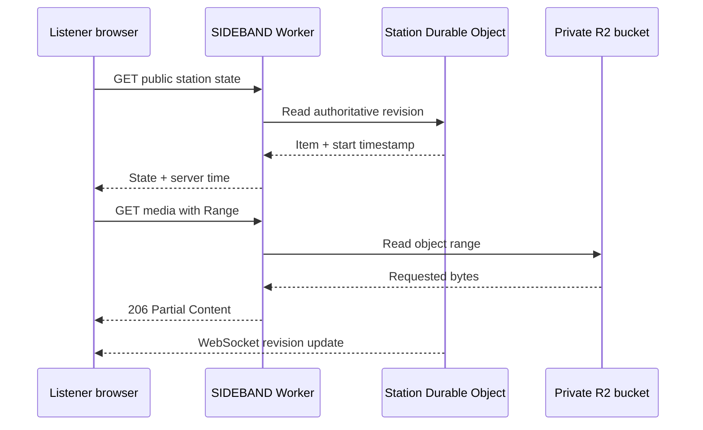

# SIDEBAND v0.4.1 Architecture

## Unified production route

Cloudflare routes `greenshoegarage.com/radio*` to the SIDEBAND Worker. The Worker removes the `/radio` deployment prefix before dispatching to static assets, public routes, administrative routes, media handling, or the Durable Object. Browser runtime configuration uses the current page directory, so API, media, and WebSocket traffic remain same-origin beneath `/radio/`. Root-relative handlers remain available to Wrangler local development and unit tests.

## Product boundary

SIDEBAND is an audio-only synchronized web station. The public browser chooses when sound begins. Prerecorded media is an HTTP object with byte-range support; it is not a traditional endless encoder stream. Live microphone audio is an optional Web Real-Time Communication (WebRTC) track distributed by Cloudflare Realtime Selective Forwarding Unit (SFU).

## Request topology



Cloudflare D1 holds metadata, schedules, history, aggregates, and audit records. Cloudflare R2 holds bytes. The Durable Object holds the current station state and listener WebSockets. No prerecorded audio bytes pass through a WebSocket.

## Authoritative state

The state record includes:

- `stationId`
- `mode`: `SCHEDULED`, `MANUAL`, `LIVE`, `PAUSED`, `FALLBACK`, or `OFFLINE`
- `source`
- `scheduleRevisionId` and `occurrenceId`
- `itemId`, `objectKey`, and public-safe item metadata
- `startedAtUtc` and `mediaOffsetSeconds`
- `durationSeconds` and `pausedAtUtc`
- `transitionId` and `nextTransitionAtUtc`
- `liveSessionId` and a public-safe live source reference
- `listenerCount`, `revision`, and `updatedAtUtc`

While playing:

```text
expectedOffset = mediaOffsetSeconds + (serverNowUtc - startedAtUtc)
```

A pause freezes the calculated offset. Resume changes `startedAtUtc` while preserving the held offset. Every transition increments `revision`; stale lower revisions are ignored.

## Listener synchronization

1. Fetch `/api/public/state` and estimate server clock skew from `serverNowUtc`.
2. Wait for audio metadata before seeking.
3. Seek to the calculated offset for a new item or a large drift.
4. Use a conservative playback-rate correction for moderate drift.
5. Ignore tiny drift to avoid audible oscillation.
6. Treat an intentional pause as behind live; never force it back automatically.
7. Use the Durable Object WebSocket when available and polling with backoff when it is not.
8. Compare state revisions before applying changes.

Refreshing never restarts an item. A sleeping Durable Object or delayed alarm uses current timestamps and the published occurrence rather than replaying missed transitions.

## Schedule publication

Draft edits live in IndexedDB until a server draft save succeeds. Publishing creates an immutable `schedule_revisions` row and deterministic `schedule_occurrences` rows. The request includes the editor’s expected published revision. A mismatch returns `SCHEDULE_REVISION_CONFLICT` rather than overwriting newer work.

Overlap resolution is deterministic: highest priority wins; equal priority uses the later start. Gaps are explicit and use the configured fallback behavior. Local recurring time conversion uses the station’s Internet Assigned Numbers Authority (IANA) time zone and reports nonexistent or repeated daylight-saving local times.

## Media delivery

`src/media.js` implements:

- full `GET` and `HEAD`
- one RFC-style `bytes=` range
- suffix and open-ended ranges
- `206 Partial Content`
- `Content-Range`, `Accept-Ranges`, `Content-Length`, `Content-Type`
- object entity tag and last-modified time
- `416 Range Not Satisfiable` with `bytes */size`

The bucket remains private. Filenames are never object identifiers. R2 keys contain stable opaque identifiers and sanitized display filenames.

## Multipart uploads

The Worker creates a multipart upload and binds its opaque upload record to the operator, station, expected R2 key, media type, size, and expiry. The browser uploads five-mebibyte parts. Pause aborts only the active part; Resume retries that part without duplicating completed parts. Complete sends the ordered part numbers and entity tags. Cancel aborts the R2 multipart upload and closes its D1 record.

## Live microphone path

1. The operator explicitly grants microphone access.
2. The browser exposes input choice, mono or stereo preference, gain, and a real level meter.
3. Local speaker monitoring remains disconnected.
4. A processed audio track is offered to `/api/admin/live/session`.
5. The Worker authenticates the operator and performs Cloudflare Realtime signaling without exposing the application secret.
6. The station state changes to `LIVE` only after Realtime returns an answer.
7. Listener browsers create receive-only sessions through `/api/public/live/subscribe`.
8. A broadcaster heartbeat refreshes a grace deadline. A Durable Object alarm, with a scheduled Worker safety check, moves an expired session to fallback.
9. End Live closes the source track, records the event, and invokes the configured fallback or schedule-resume path.

## Failure design

| Failure | Behavior |
| --- | --- |
| Autoplay denied | Display Tap Listen; never claim playback |
| WebSocket unavailable | Poll state; reconnect with bounded backoff |
| Current R2 object missing | Return actionable error; operator starts fallback |
| Upload interruption | Retry current part; retain completed parts |
| Stale publication | Reject with a revision conflict |
| Realtime unconfigured | Disable Take Live; scheduled station continues |
| Live heartbeat expires | Durable Object or scheduled safety check starts fallback |
| Offline Studio | Save local draft; do not claim publication or on-air action |

## Privacy boundary

Listener state contains only public metadata. Private notes, storage keys, multipart identifiers, operator assertions, secrets, and R2 bindings never appear in public responses. Aggregate metrics do not retain Internet Protocol addresses, exact locations, advertising identifiers, or raw user-agent strings.
